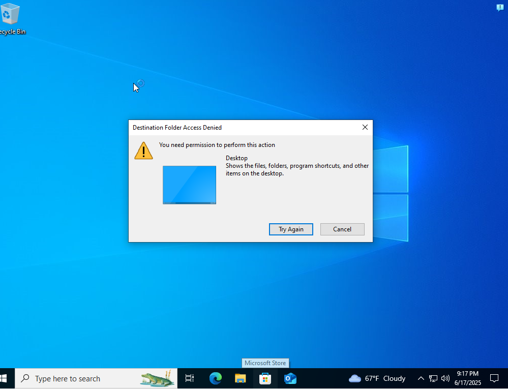

# 🛠️ Ticket Resolution: Redirect Desktop Files to Personal Drive 

This document outlines the resolution of Jira ticket SUP-16, User requested that any files saved to their desktop be automatically redirected to their assigned personal drive for easier organization and access. This task involved confirming the request, validating system access, configuring a Group Policy Object (GPO) to redirect Desktop files, and resolving related permission issues.

## Ticket Review and Initial Response:

- Ticket Title: Desktop files to Personal Drive

- PC Name: Desktop2 (recorded via internal note for IT reference)

- The user asked if files saved to their Desktop could be redirected to their Personal drive.

- The IT technician responded by acknowledging the request and asked for the PC name to begin remote validation.

##🖥️ Initial Investigation:

-> Upon remote access, a folder named ckent was visible on the user's Desktop, containing files the user wanted automatically redirected.

-> On the domain controller (Server2022), the Personal share was checked under C:\Shares\Personal\ckent, which was still empty — confirming redirection had not yet been applied.

Based on the images above you can tell that setting this up is not going to be easy as pushing a couple of buttons , their is a process to this and as you go down below through the steps and view the images you will see how we come to solving this issue 

##🧰 GPO Configuration:

1. Opened Group Policy Management > Navigated to anthonytech.com domain.

2. Created a new GPO named Redirect Folders. > then go to edit and that should take you to the image down below 

3. Edited the GPO under:

User Configuration > Policies > Windows Settings > Folder Redirection > Desktop

4. Settings Applied:

- Chose: Basic - Redirect everyone's folder to the same location

- Set root path: \\SERVER2022\Personal

- This ensures each user's Desktop files are redirected to a personal folder under the shared drive.

##🧩 GPO Assignment & Enforcement:

- The GPO was linked to the HR Organizational Unit where the user ckent resides. and was enforced

- A gpupdate /force command was executed from the user’s PC to manually apply the policy.

- Windows prompted a logout due to folder redirection changes requiring a new session

##⚠️ Permissions Issue & Resolution:

When attempting to address the isssues some other complications arise as well that might not be best practice , that is why it is helpful to advise with your supervisors for doing changes this big

- After redirection, C:\Shares\Personal\ckent\Desktop was created, but access was initially denied on the server2022 DC PC.

To solve the image above you just click continue until you are allowed to change the owner of the folder, and the image below shows you how to do that 

- took ownership of the desktop folder as Domain Admin
- checked -> replace owner on subcontainers and objects

No once solving this issue there also arises new complications on the users side that is why remoting in would be best practice to see if everything was assinged properly and in this case it was not , as you can see in the image down below 

This issue arrise when you assinged the folder incorrectly, as you can see in the image down below 

To resolve this issue you would: 

- Assigned Modify permissions to:

- ckent@anthonytech.com (the user)

- Helpdesk (for future administrative troubleshooting)

##✅ Final Verification:

- A test folder was created on the user’s Desktop.

- It immediately appeared in C:\Shares\Personal\ckent\Desktop, confirming successful redirection.

- The ticket was then marked as Resolved, with a closing message confirming that the user could now save directly to the personal drive via the Desktop

